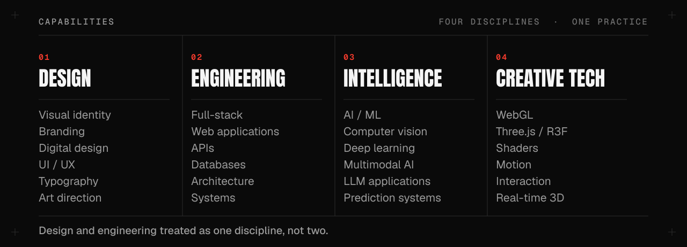
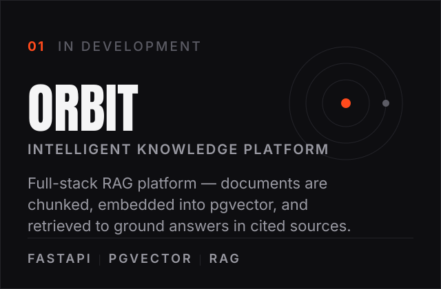
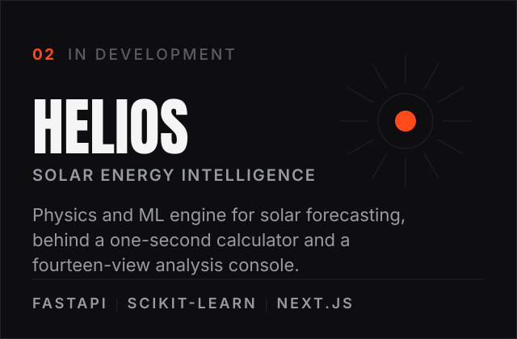
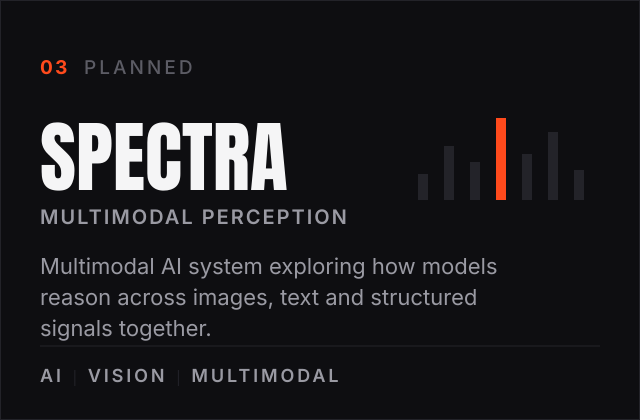
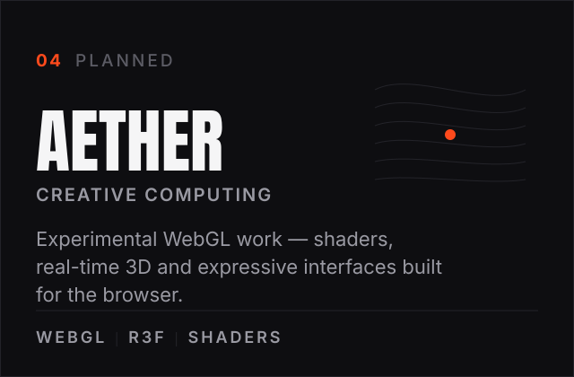
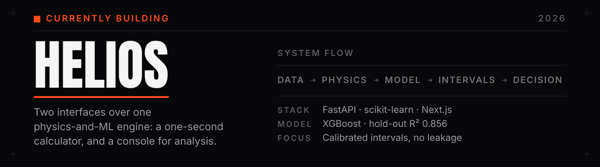
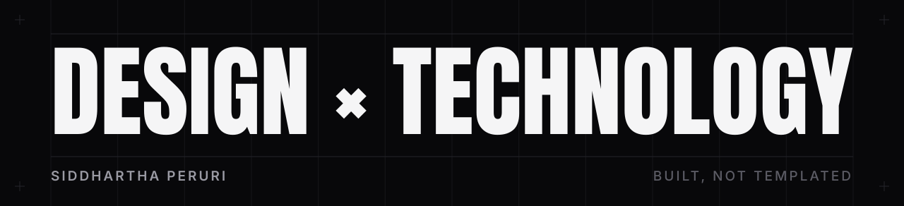

<picture>
  <source media="(prefers-color-scheme: dark)" srcset="./assets/hero-dark.svg">
  <source media="(prefers-color-scheme: light)" srcset="./assets/hero-light.svg">
  
</picture>

 

<a href="YOUR_PORTFOLIO_URL"><b>PORTFOLIO</b></a>
&nbsp;·&nbsp;
<a href="YOUR_LINKEDIN_URL"><b>LINKEDIN</b></a>
&nbsp;·&nbsp;
<a href="YOUR_BEHANCE_URL"><b>BEHANCE</b></a>
&nbsp;·&nbsp;
<a href="mailto:YOUR_EMAIL"><b>EMAIL</b></a>

 

<picture>
  <source media="(prefers-color-scheme: dark)" srcset="./assets/matrix-dark.svg">
  <source media="(prefers-color-scheme: light)" srcset="./assets/matrix-light.svg">
  
</picture>

 

## Selected work

<picture>
  <source media="(prefers-color-scheme: dark)" srcset="./assets/card-orbit-dark.svg">
  <source media="(prefers-color-scheme: light)" srcset="./assets/card-orbit-light.svg">
  
</picture>
<picture>
  <source media="(prefers-color-scheme: dark)" srcset="./assets/card-helios-dark.svg">
  <source media="(prefers-color-scheme: light)" srcset="./assets/card-helios-light.svg">
  
</picture>
<picture>
  <source media="(prefers-color-scheme: dark)" srcset="./assets/card-spectra-dark.svg">
  <source media="(prefers-color-scheme: light)" srcset="./assets/card-spectra-light.svg">
  
</picture>
<picture>
  <source media="(prefers-color-scheme: dark)" srcset="./assets/card-aether-dark.svg">
  <source media="(prefers-color-scheme: light)" srcset="./assets/card-aether-light.svg">
  
</picture>

 

<picture>
  <source media="(prefers-color-scheme: dark)" srcset="./assets/now-dark.svg">
  <source media="(prefers-color-scheme: light)" srcset="./assets/now-light.svg">
  
</picture>

 

## Stack

**Languages** — Python · Java · TypeScript  
**Web** — React · Next.js · TypeScript · Tailwind CSS  
**Creative** — WebGL · Three.js / R3F · GSAP · Shaders  
**AI / ML** — PyTorch · scikit-learn · RAG · LLM APIs  
**Backend** — FastAPI · PostgreSQL / pgvector · Redis · Docker  
**Tools** — Git · Jupyter · Figma · Lightroom

## How I work

Interfaces should feel considered, not merely functional. In practice that means
intentional layout over templates, restrained motion over constant animation,
3D that carries meaning rather than decoration, and typography doing the heavy
lifting.

 

<picture>
  <source media="(prefers-color-scheme: dark)" srcset="./assets/footer-dark.svg">
  <source media="(prefers-color-scheme: light)" srcset="./assets/footer-light.svg">
  
</picture>

Every graphic here is generated from a design system in <a href="./tools">/tools</a> — type set as outlines, light and dark built from one source.

