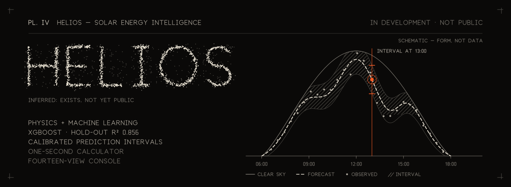
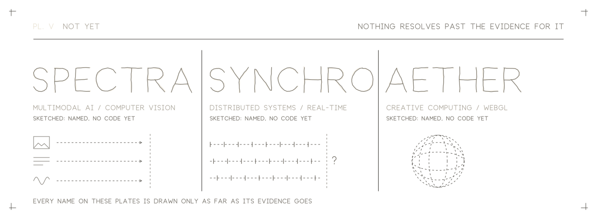
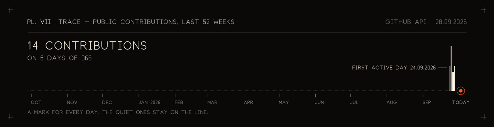

<!--
  Every image on this page is drawn by tools/build_assets.py in the stroke alphabet
  of SIDDHARTHA (github.com/Siddhuperuri/miracle): plates in assets/, the words
  between them in assets/labels/. Edit the source, not the SVGs.
-->

<picture>
  <source media="(prefers-color-scheme: dark)" srcset="./assets/hero-dark.svg">
  <source media="(prefers-color-scheme: light)" srcset="./assets/hero-light.svg">
  
</picture>

<picture><source media="(prefers-color-scheme: dark)" srcset="./assets/labels/statement-dark.svg"><source media="(prefers-color-scheme: light)" srcset="./assets/labels/statement-light.svg"></picture>

<a href="https://github.com/Siddhuperuri/miracle"><picture><source media="(prefers-color-scheme: dark)" srcset="./assets/labels/link-artwork-dark.svg"><source media="(prefers-color-scheme: light)" srcset="./assets/labels/link-artwork-light.svg"></picture></a>
&nbsp;&nbsp;
<a href="https://siddhartha-portfolio-nine.vercel.app"><picture><source media="(prefers-color-scheme: dark)" srcset="./assets/labels/link-portfolio-dark.svg"><source media="(prefers-color-scheme: light)" srcset="./assets/labels/link-portfolio-light.svg"></picture></a>
&nbsp;&nbsp;
<a href="https://www.linkedin.com/in/siddharthaperuri"><picture><source media="(prefers-color-scheme: dark)" srcset="./assets/labels/link-linkedin-dark.svg"><source media="(prefers-color-scheme: light)" srcset="./assets/labels/link-linkedin-light.svg"></picture></a>
&nbsp;&nbsp;
<a href="https://www.behance.net/siddharperuri"><picture><source media="(prefers-color-scheme: dark)" srcset="./assets/labels/link-behance-dark.svg"><source media="(prefers-color-scheme: light)" srcset="./assets/labels/link-behance-light.svg"></picture></a>

 

<picture>
  <source media="(prefers-color-scheme: dark)" srcset="./assets/artwork-dark.svg">
  <source media="(prefers-color-scheme: light)" srcset="./assets/artwork-light.svg">
  
</picture>

<a href="https://github.com/Siddhuperuri/miracle"><picture><source media="(prefers-color-scheme: dark)" srcset="./assets/labels/artwork-dark.svg"><source media="(prefers-color-scheme: light)" srcset="./assets/labels/artwork-light.svg"></picture></a>

 

<picture>
  <source media="(prefers-color-scheme: dark)" srcset="./assets/orbit-dark.svg">
  <source media="(prefers-color-scheme: light)" srcset="./assets/orbit-light.svg">
  
</picture>

<a href="https://github.com/Siddhuperuri/orbit"><picture><source media="(prefers-color-scheme: dark)" srcset="./assets/labels/orbit-dark.svg"><source media="(prefers-color-scheme: light)" srcset="./assets/labels/orbit-light.svg"></picture></a>

 

<picture>
  <source media="(prefers-color-scheme: dark)" srcset="./assets/helios-dark.svg">
  <source media="(prefers-color-scheme: light)" srcset="./assets/helios-light.svg">
  
</picture>

<picture><source media="(prefers-color-scheme: dark)" srcset="./assets/labels/helios-dark.svg"><source media="(prefers-color-scheme: light)" srcset="./assets/labels/helios-light.svg"></picture>

 

<picture>
  <source media="(prefers-color-scheme: dark)" srcset="./assets/not-yet-dark.svg">
  <source media="(prefers-color-scheme: light)" srcset="./assets/not-yet-light.svg">
  
</picture>

<picture><source media="(prefers-color-scheme: dark)" srcset="./assets/labels/not-yet-dark.svg"><source media="(prefers-color-scheme: light)" srcset="./assets/labels/not-yet-light.svg"></picture>

 

<picture>
  <source media="(prefers-color-scheme: dark)" srcset="./assets/card-dark.svg">
  <source media="(prefers-color-scheme: light)" srcset="./assets/card-light.svg">
  
</picture>

<picture><source media="(prefers-color-scheme: dark)" srcset="./assets/labels/card-dark.svg"><source media="(prefers-color-scheme: light)" srcset="./assets/labels/card-light.svg"></picture>

<picture><source media="(prefers-color-scheme: dark)" srcset="./assets/labels/link-card-text-dark.svg"><source media="(prefers-color-scheme: light)" srcset="./assets/labels/link-card-text-light.svg"></picture>

 

| Work | Made with |
|:--|:--|
| SIDDHARTHA | HTML, CSS, JavaScript, three.js |
| ORBIT | Python, TypeScript, Celery, embeddings, pgvector, Next.js, Tailwind, FastAPI, PostgreSQL, Redis, MinIO, Docker, GitHub Actions |
| HELIOS | Python, scikit-learn, XGBoost, Next.js, FastAPI |
| This profile | Python, SVG, GitHub Actions |
| Gravity Playground | HTML, CSS, JavaScript. A custom physics engine: forces, orbits, collisions that merge. |
| Travelease | HTML, CSS, JavaScript. Tourism planning with a location-based treasure hunt. |
| PETPONKS | Figma, Framer. Identity and wireframes for a pet platform. |
| SPECTRA, SYNCHRO, AETHER | Not yet punched |

 

<picture>
  <source media="(prefers-color-scheme: dark)" srcset="./assets/trace-dark.svg">
  <source media="(prefers-color-scheme: light)" srcset="./assets/trace-light.svg">
  
</picture>

<picture><source media="(prefers-color-scheme: dark)" srcset="./assets/labels/trace-dark.svg"><source media="(prefers-color-scheme: light)" srcset="./assets/labels/trace-light.svg"></picture>

 

<picture>
  <source media="(prefers-color-scheme: dark)" srcset="./assets/end-dark.svg">
  <source media="(prefers-color-scheme: light)" srcset="./assets/end-light.svg">
  
</picture>

<a href="https://github.com/Siddhuperuri/miracle"><picture><source media="(prefers-color-scheme: dark)" srcset="./assets/labels/end-dark.svg"><source media="(prefers-color-scheme: light)" srcset="./assets/labels/end-light.svg"></picture></a>

