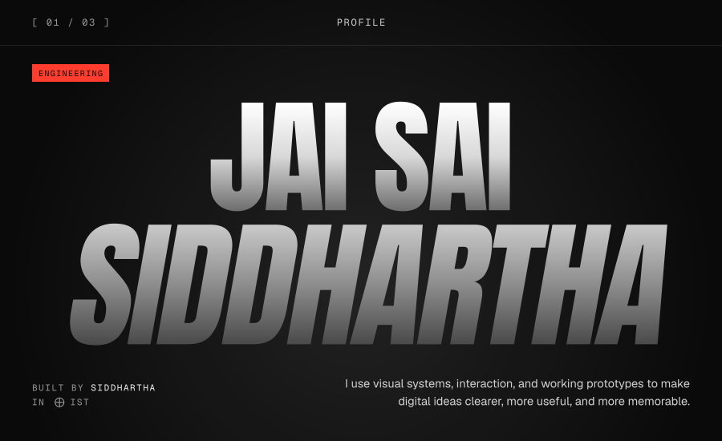
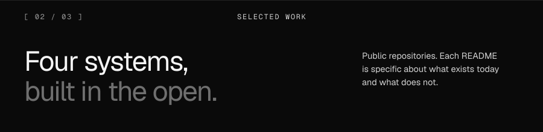
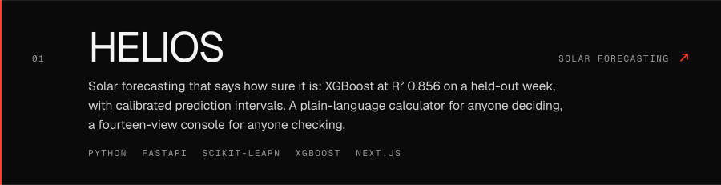
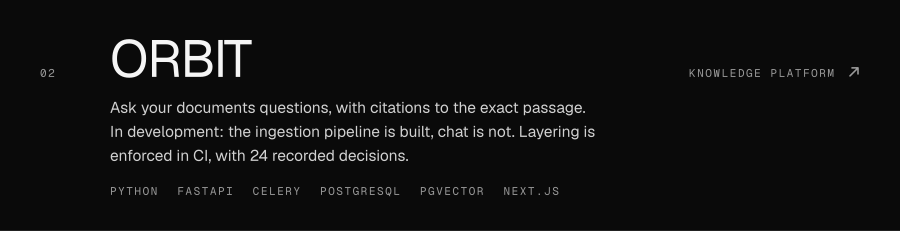
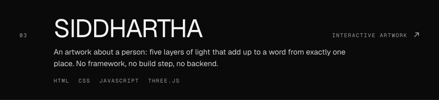
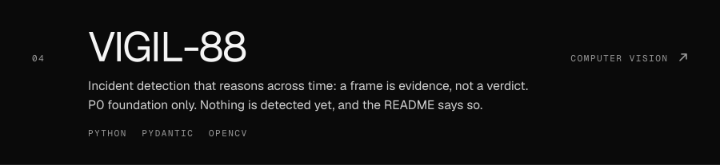
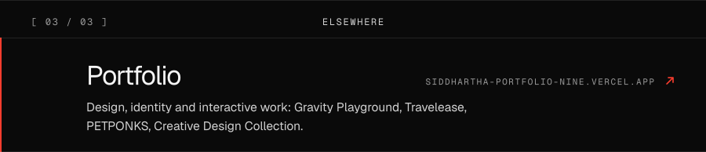
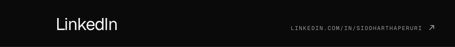
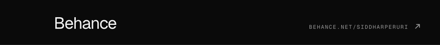
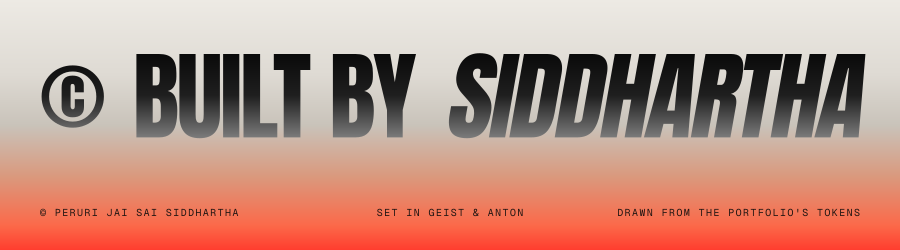

<!--
  Every image on this page is drawn by tools/build_assets.py from the portfolio's design
  tokens, and so is this file. Edit the source and rebuild; do not edit the SVGs or this README.
-->

 
 
 
 
 
 
 
 
 
 
